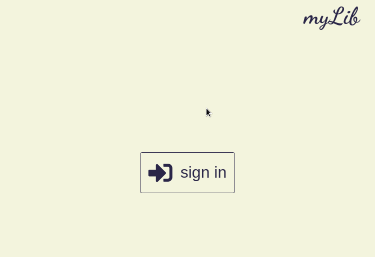

# myLib
This repository is the solution to one of the assignments given in [The Odin Project]() - a web development course. Purpose of this exercise was to practice object oriented programming and use of classes in javascript. 

myLib is a responsive web application used to store user books. All data is storaged in firebase. Currently there is only option to login via google account. 

